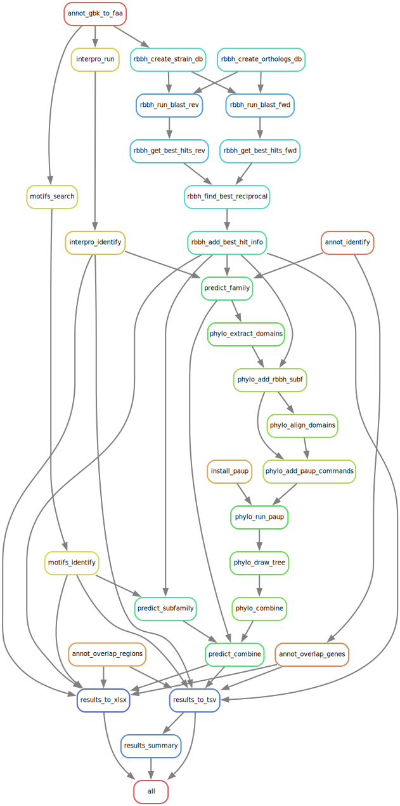

# *M. tuberculosis* PE/PPE Snakemake pipeline
This Snakemake pipeline identifies and classifies PE and PPE genes in *M. tuberculosis* genomes. To do so, it relies on the provided genome annotation, predictions by InterProScan, motif searches, phylogenetic analysis of n-terminal domains as described in [van Pittius et al. 2006](https://doi.org/10.1186/1471-2148-6-95) and a manually curated set of PE and PPE genes in the strain H37Rv ([Ates 2020](https://doi.org/10.1111/mmi.14409)). The output is a formatted Excel table containing all results as well as plots of the phylogenetic trees based on the n-terminal domains.

## Software Dependencies
By default, all dependencies are installed automatically using conda except for InterProScan, for which this is unfortunately not possible due to reliance on licensed components (SignalP and TMHMM) and the size of the database. InterProScan therefore has to be downloaded separately and the path to its folder (the folder containing `interproscan.sh`) has to be adapted in `config/config.yml`. To install InterProScan, follow the [official instructions](https://interproscan-docs.readthedocs.io/en/v5/HowToDownload.html), including the steps to [install SignalP and TMHMM](https://interproscan-docs.readthedocs.io/en/v5/ActivatingLicensedAnalyses.html). All dependencies required to run InterProScan are automatically installed with conda.

If the prediction of signal peptides and transmembrane domains is not required, the installation of SignalP and TMHMM can be ommitted. In this case, `TMHMM` and `SignalP_GRAM_POSITIVE` may be removed from the `interpro:analyses` list in `config/config.yaml` as these columns will always be empty.

To disable automatic dependency management with conda, remove `--use-conda` from `run.sh` and make sure the dependencies are installed system-wide:
```
sudo apt install clustalw python2.7-dev libpcre3-dev ncbi-blast+ openjdk-11-jre-headless python3-biopython python3-ete3 python3-matplotlib python3-pandas
```

## Input Data
### Variable
The input data to reproduce the results from an analysis of 6 *M. tuberculosis* clinical reference strains from lineages 1 and 2 ([Heiniger et al., 2026](https://doi.org/10.64898/2026.01.27.701740)) is provided in the `data` folder. The files are sorted into the following subfolders:

|subfolder|filename|content|
|---------|-------|--------|
|data/annotation|{strain}.gbff|genome annotations in GenBank format|
|data/genes|{strain}.tsv|tables of genes to check for overlaps with the identified PE/PPE genes (based on locus tag)|
|data/regions|{strain}.bed|BED files of regions to check for overlaps with the identified PE/PPE genes (based on coordinates)|

The filenames have to match the `strains` list in `config/config.yaml` (not including the file extension). Therefore, to analyze own genomes, add the GenBank files with the correct extension to the `data/annotation` folder and update the `strains` list in `config/config.yaml`. Also make sure to create a corresponding file in `data/genes` and `data/regions`.

> **NOTE:**  If you are not interested in the overlap with a subset of annotated genes or specific regions, just create an empty file for the strain in the respective directory: `touch data/genes/{strain}.tsv data/regions/{strain}.bed`

### Static
An additional subfolder (`data/orthologs`) contains the classification of PE and PPE genes in strain H37Rv from [Ates 2020](https://doi.org/10.1111/mmi.14409) as a tsv file and the corresponding protein sequences in fasta format. This folder can generally be left unchanged except if the usage of a different or updated classification of PE and PPE genes is desired.

## Running the Analyis
Once the input data is ready and Snakemake is installed, the analysis can be started with
```
./run.sh
```

> **NOTE:**  If you are not behind a corporate proxy, you may speed up the InterProScan analysis by enabling the precalculated match lookup service. To do so, remove the `-dp` flag from `interproscan:flags` in `config/config.yaml`.

After successfully running the pipeline, an HTML report of the results may be generated with
```
./create_report.sh
```

## Output
The most important results files are collected in the HTML report. These include:
|filepath|contents|
|--------|--------|
|`results/results_summary.xlsx`|total counts of genes identified per family, subfamily and sublineage|
|`results/results_combined.xlsx`|lists of individual genes per strains and their classification|
|`results/phylo/draw_tree/PE/{strain}_PE_tree.png`|phylogenetic tree of n-terminal domains from all PE genes in this strain|
|`results/phylo/draw_tree/PPE/{strain}_PPE_tree.png`|phylogenetic tree of n-terminal domains from all PPE genes in this strain|

For each strain, a worksheet is included in `results_combined.xlsx` containing the identified PE and PPE genes and with the following columns (provided the TMHMM and signalP analyses are enabled in InterProScan):

|columns|explanation|
|-------|-----------|
|A-E|Final family and subfamily prediction consolidating all analyses|
|F|Phylogenetic sublineage prediction based on n-terminal domain|
|G-J|PE and PPE family proteins identified by the PGAP annotation|
|K-L|Overlap with genes defined in `data/genes`
|M|Overlap with regions defined in `data/regions`
|Q-U|matching domains identified by InterProScan 5.59-91.0 and corresponding subfamily prediction|
|V-Z|subfamily prediction based on a search of identifying sequence motifs|
|AA-AN|reciprocal best BLAST hits (RBBH) against a set of manually curated and annotated PE and PPE proteins from H37Rv ([Ates 2020](https://doi.org/10.1111/mmi.14409))|

## Application to Other Gene Families
By adjusting the motif and domain information in `config/config.yml` and providing a set of known orthologs in `data/orthologs` as a tsv and faa file, it should be possible to identify other protein families and categorize them by their n-terminal domain and the presence of specific sequence motifs.

The regexes defined in `config/config.yml` enable the identification of the gene family of interest from the product description of the annotation and consist of the following parts, here explained for `'(^|[^\w])PE($|[^A-Za-z])'`:

|regex part|explanation|
|----------|-----------|
|`(^\|[^\w])`|The pattern is either at the start of the description or not preceeded by an alphanumeric character or _|
|`PE`|The actual pattern we're looking for, in this example PE genes|
|`($\|[^A-Za-z])`|The pattern is either at the end of the description or not followed by a letter|

The outgroup regex is used to root the phylogenetic tree based on the n-terminal domain of the protein family, for which the number of n-terminal amino acids specified in `nterm_aa` is used. The domain names and the names of the sublineage colors in `config/config.yml` have to match the ones defined in `orthologs/orthologs.tsv`.

## Rulegraph


## Citation
**Proteogenomic discovery of novel small proteins in clinical Mycobacterium tuberculosis strains**

Benjamin Heiniger, Christian Schori, Mohammad Arefian, Amir Banaei-Esfahani, Martin Schuler, Sonia Borrell, Chloe Loiseau, Daniela Brites, Iñaki Comas, Ruedi Aebersold, Sebastien Gagneux, Ben C. Collins, Christian H. Ahrens

bioRxiv 2026.01.27.701740; doi: https://doi.org/10.64898/2026.01.27.701740